# 🛒 Full-Stack E-Commerce Website (Laravel)

## 📌 Project Overview
This is a full-stack e-commerce web application built with Laravel.
The platform allows customers to browse products, add them to a shopping cart, place orders, and pay securely using PayPal.
An admin dashboard is included to manage products, categories, orders, and users.

This project simulates a real online store with complete order and payment flow.

---

## 🚀 Features

### 🧑‍💻 Customer Side
- Browse products by category
- View product details
- Add / remove products from shopping cart
- Manage delivery address
- Checkout and pay using **PayPal**
- Order confirmation

### 🛠 Admin Dashboard
- Secure admin authentication
- Full CRUD for products and categories
- Manage orders and order status
- View customers and order history
- Dashboard overview (products, orders, users)

---

## 🧰 Tech Stack
- **Backend:** Laravel (PHP)
- **Frontend:** Blade, HTML, CSS, JavaScript
- **Database:** MySQL
- **Payment Gateway:** PayPal
- **Authentication:** Laravel Auth
- **Architecture:** MVC

---

## 🗂 Database Structure (Summary)
- Users
- Products
- Categories
- Orders
- Order items
- Addresses
- Payments

---

## 📷 Screenshots

### Homepage


### Product Details
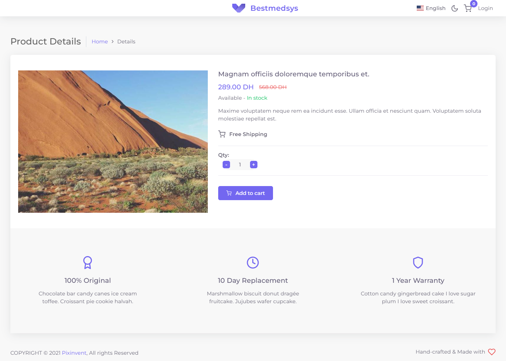

### Add To Card
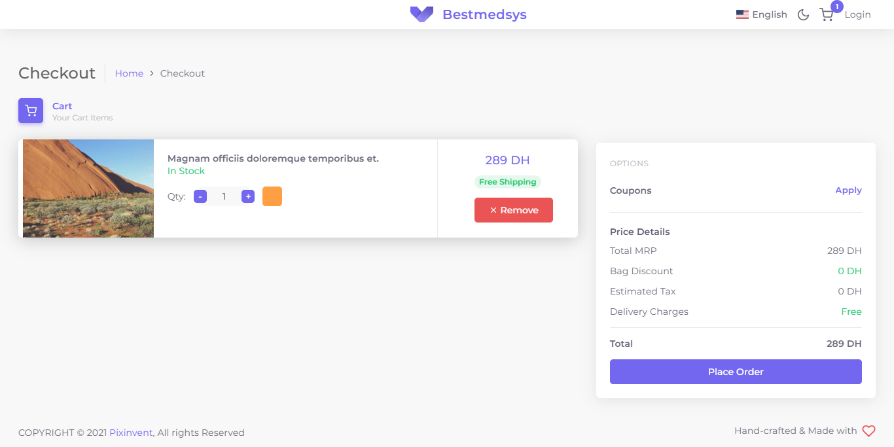

### Place Order
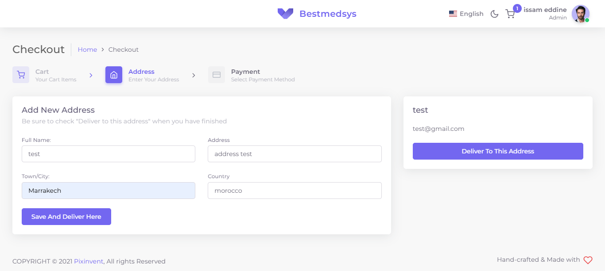

### Login/Create Account
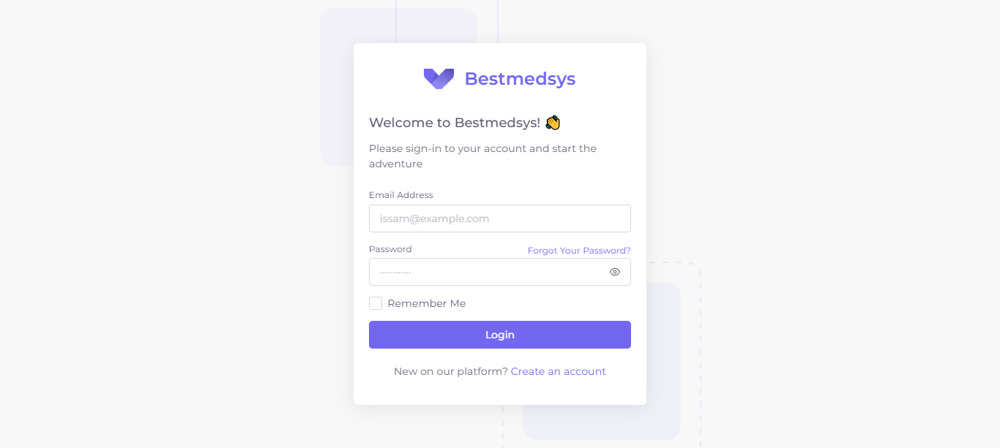
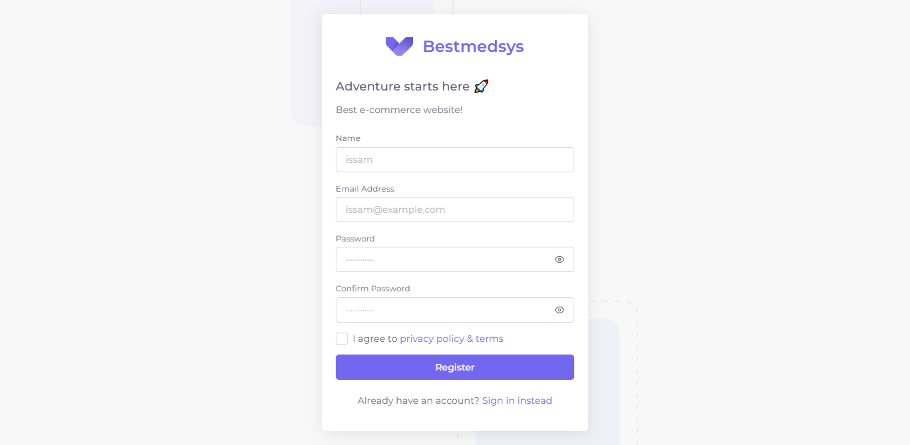

### Verification Email
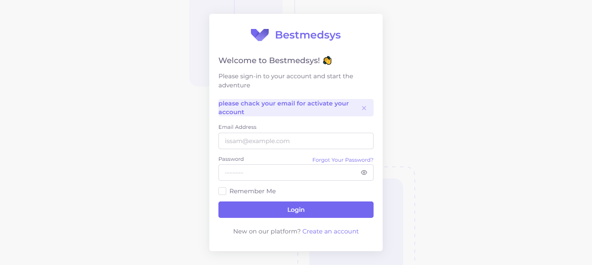

### Verification Email Button
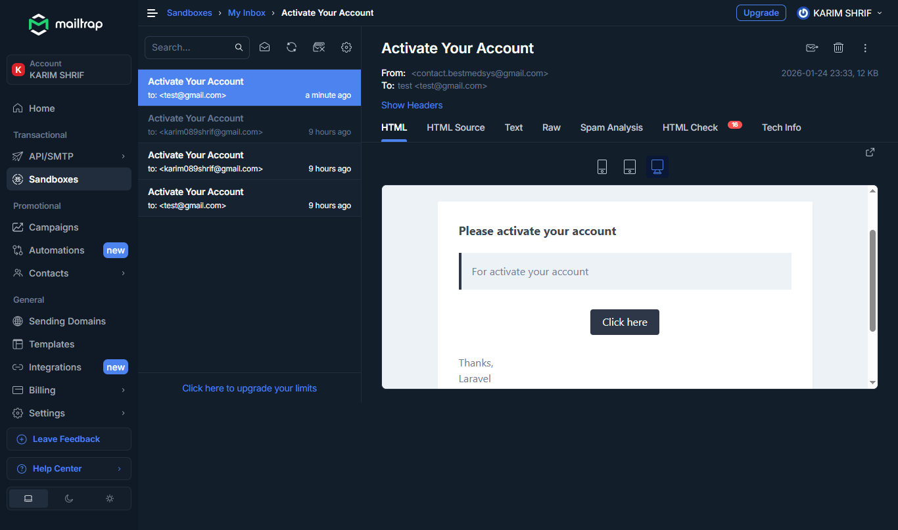

### Add Address
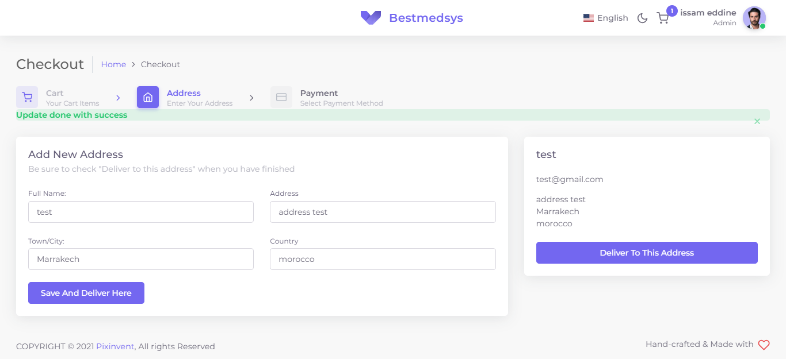

### PayPal Payment
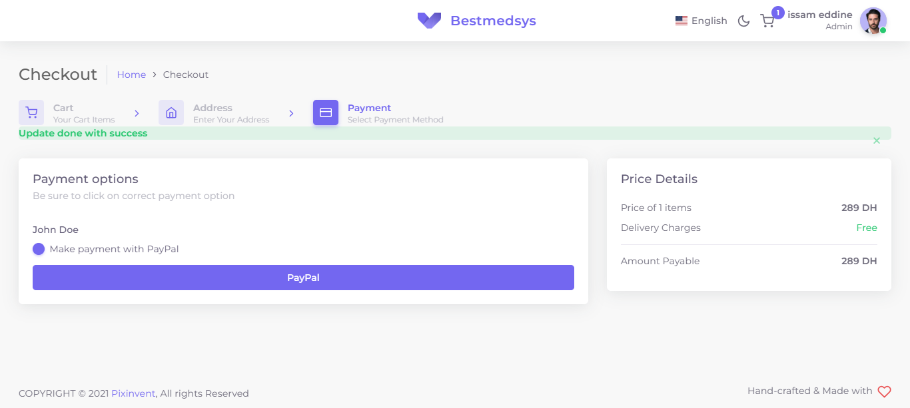

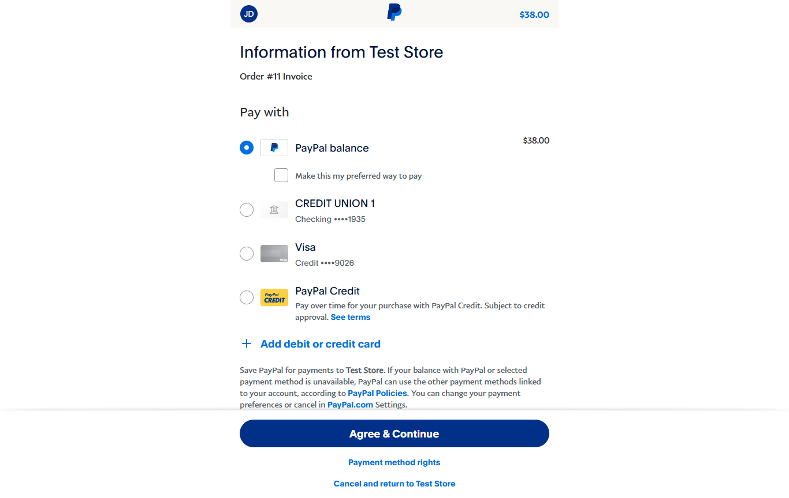
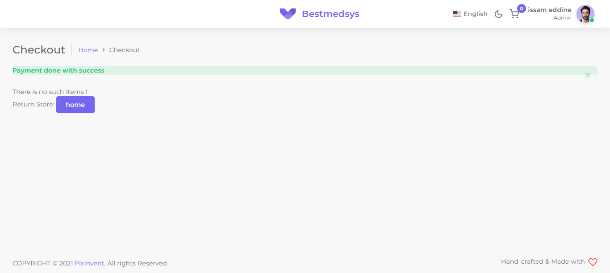

### Admin Dashboard
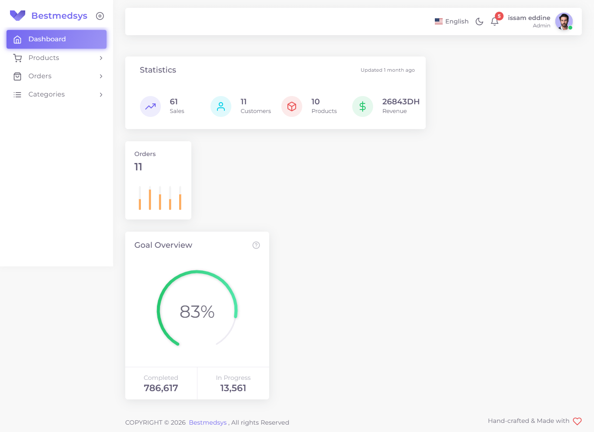

### OrderS List
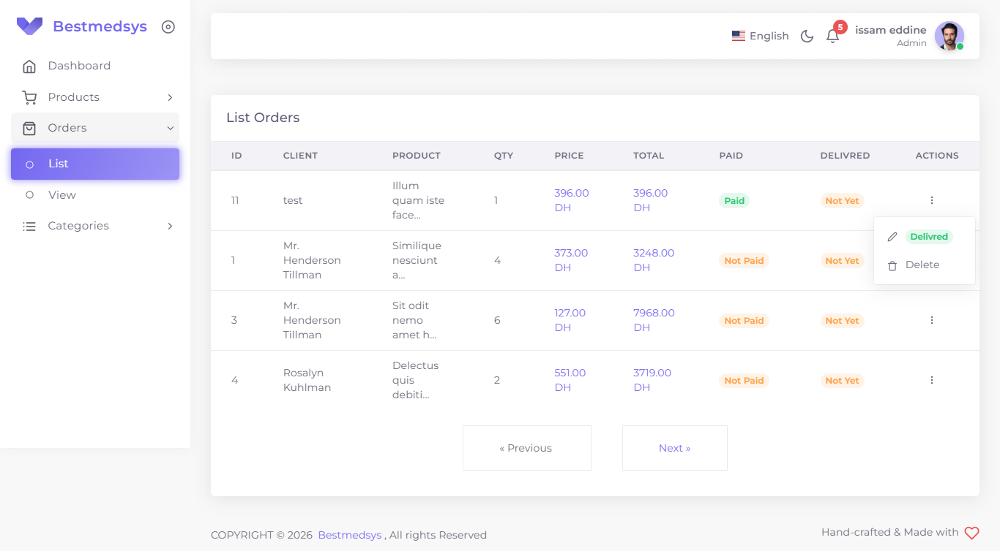

---

## ⚙️ Installation & Setup

```bash
git clone https://github.com/your-username/ecommerce-laravel.git
cd ecommerce-laravel
composer install
cp .env.example .env
php artisan key:generate
php artisan migrate
php artisan serve
